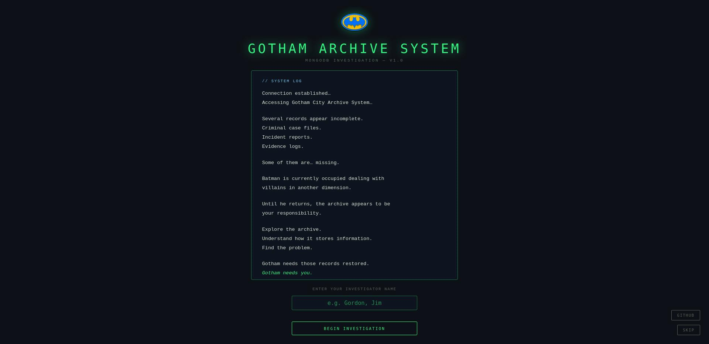
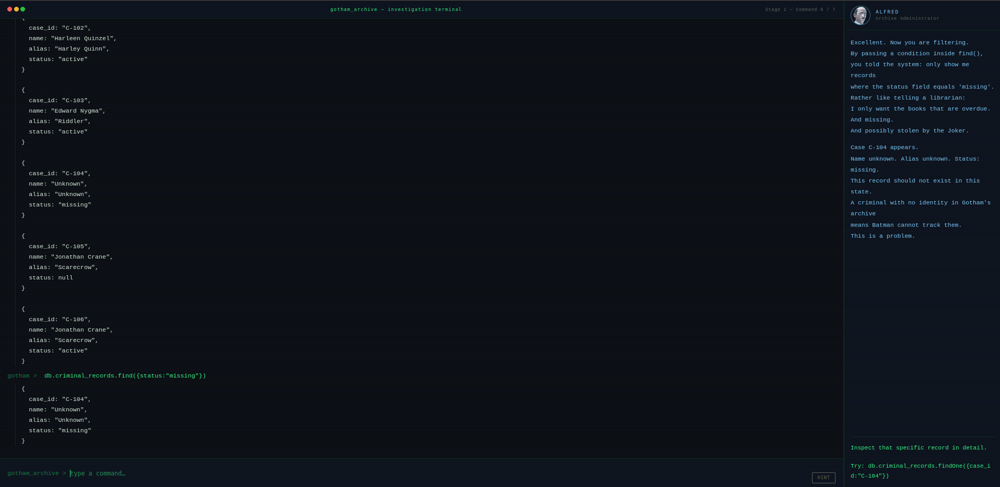

# MongoDB Investigation — Gotham Archive System

A browser-based project where you learn MongoDB by investigating a broken criminal database inside **Gotham City**.

No tutorials. No reading walls of text. You open a terminal, type commands, and **Alfred** explains what each one does as you go. The database has corrupted records and you have to fix them.

---

## How it works

The experience is split into four stages.

**Stage 1 — Terminal Investigation**
You explore the Gotham Archive using read commands. Alfred walks you through each one. By the end you will have found three corruptions hiding inside the criminal records.







**Stage 2 — Fix Gotham Archive**
You fix what you found. One record needs its status updated. One is completely missing and needs to be inserted from scratch. One is a duplicate that needs to be removed.

**Stage 3 — Card Challenge**
Six questions based on what you just did. Your score affects the final restoration percentage.

**Stage 4 — Certification**
If the archive is restored, you get a certificate with your name, score, and restoration percentage. Downloadable as a PNG.

There is also a results screen with Alfred's assessment and a Batman meme depending on how well you did.

---

## Commands you will use

`show dbs` — list all databases

`use <database>` — connect to a database

`show collections` — see what collections exist inside

`db.collection.find()` — get all documents

`db.collection.find({filter})` — get filtered documents

`db.collection.findOne({filter})` — get one specific document

`db.collection.updateOne()` — update a field

`db.collection.insertOne()` — add a new document

`db.collection.deleteOne()` — remove a document

---

## Running it

No installation needed. Just download the `.zip` file and open `index.html` in a browser and it works.

---

## Project structure

```
mongodb-investigation/
├── index.html
├── README.md
├── css/
│   └── style.css
├── js/
│   ├── archive.js
│   ├── terminal.js
│   ├── repair.js
│   ├── quiz.js
│   └── game.js
└── assets/
    ├── images/
    ├── memes/
    └── screenshots/
```

---

## Scoring

The restoration percentage comes from three things. Terminal stage is worth 10%, the repair stage is 20%, and the quiz is 70%. Alfred's final report changes based on where you land.

---

## Mission Brief

Batman is busy. If the archive fails, even Batman will have trouble tracking criminals.

**Gotham needs you**.
