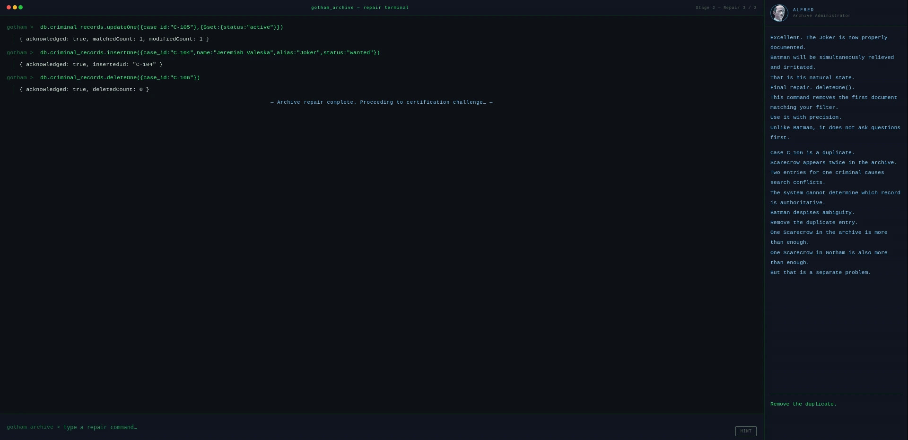
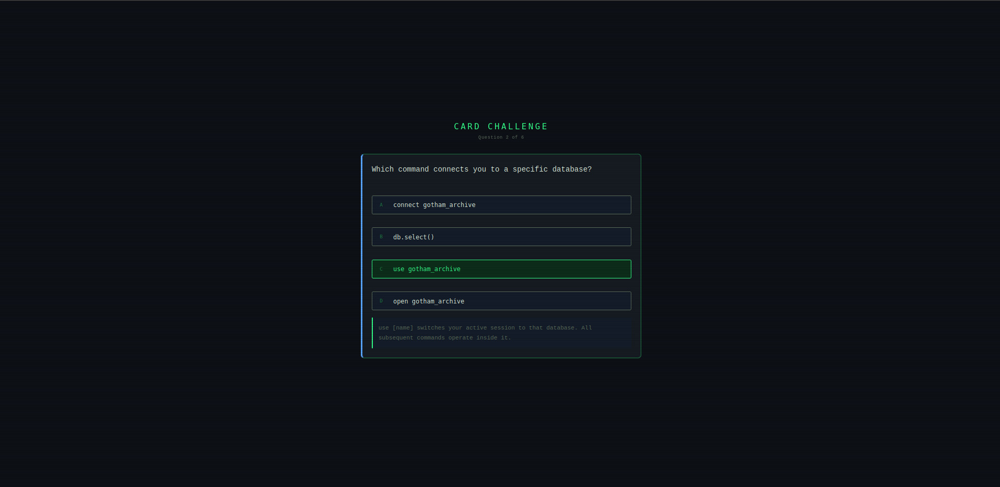

# MongoDB Investigation - Gotham Archive System

A browser-based project where you learn MongoDB by investigating a broken criminal database inside **Gotham City**.

No tutorials. No reading walls of text. You open a terminal, type commands, and **Alfred** explains what each one does as you go. The database has corrupted records and you have to fix them.

---

## How it works

The experience is split into four stages.

**Stage 1 - Terminal Investigation**
You explore the Gotham Archive using read commands. Alfred walks you through each one. By the end you will have found three corruptions hiding inside the criminal records.

&nbsp;

*Stage 1 - terminal investigation uncovering corrupted criminal records*
&nbsp;

**Stage 2 - Fix Gotham Archive**
You fix what you found. One record needs its status updated. One is completely missing and needs to be inserted from scratch. One is a duplicate that needs to be removed.

&nbsp;

*Stage 2 - archive repair using updateOne, insertOne, and deleteOne*
&nbsp;

**Stage 3 - Card Challenge**
Six questions based on what you just did. Your score affects the final restoration percentage.

&nbsp;

*Stage 3 - card challenge testing your knowledge of MongoDB commands*
&nbsp;

&nbsp;

*Stage 3 - restoration percentage and Alfred's final assessment*
&nbsp;

**Stage 4 - Certification**
If the archive is restored, you get a certificate with your name, score, and restoration percentage. Downloadable as a PNG.

&nbsp;

*Stage 1 - terminal investigation uncovering corrupted criminal records*
&nbsp;

> There is also a results screen with Alfred's assessment and a Batman meme depending on how well you did.

---

## Commands you will use

**`show dbs`** - list all databases

**`use <database>`** - connect to a database

**`show collections`** - see what collections exist inside

**`db.collection.find()`** - get all documents

**`db.collection.find({filter})`** - get filtered documents

**`db.collection.findOne({filter})`** - get one specific document

**`db.collection.updateOne()`** - update a field

**`db.collection.insertOne()`** - add a new document

**`db.collection.deleteOne()`** - remove a document

---

## Themes

The archive supports two visual modes. Switch between them at any time using the toggle in the top left corner.

**GOTHAM** - dark terminal aesthetic with green text and scanlines. Default mode.

&nbsp;

&nbsp;

**NOIR** - aged paper aesthetic with dark ink tones. Easier on the eyes in bright environments.

&nbsp;

&nbsp;

The theme carries across all stages including the downloadable certificate.

---

## Running it

**Live version** - https://gaisma22.github.io/mongodb-investigation/

No installation needed. Three ways to run it:

- Open the live link directly in a browser
- Clone the repo and open `index.html`
- Download the `.zip`, extract it, and open `index.html`

> **Note** - this project runs on vanilla JavaScript. If you have a script-blocking extension like NoScript enabled, disable it for this page or nothing will load.

---

## Project structure

```
mongodb-investigation/
├── index.html
├── README.md
├── css/
│   └── style.css
├── js/
│   ├── archive.js
│   ├── terminal.js
│   ├── repair.js
│   ├── quiz.js
│   └── game.js
└── assets/
    ├── images/
    │   ├── gotham/
    │   └── noir/
    ├── memes/
    └── screenshots/
```

---

## Scoring

The restoration percentage comes from three things. Terminal stage is worth **10%**, the repair stage is **20%**, and the quiz is **70%**. Alfred's final report changes based on where you land.

---

## Mission Brief

Batman is busy. If the archive fails, even Batman will have trouble tracking criminals.

**Gotham needs you**.
